# Pokédex

[](https://app.netlify.com/sites/pokedex-lit/deploys)

Aplicación web para explorar los Pokémon de la [PokéAPI](https://pokeapi.co). Está construida con [Lit](https://lit.dev) (Web Components sobre Shadow DOM), sin framework de aplicación. Combina un listado paginado de tarjetas con una Pokédex retro interactiva que muestra la ficha completa de cada especie.

**Demo:** https://pokemowiki.netlify.app/

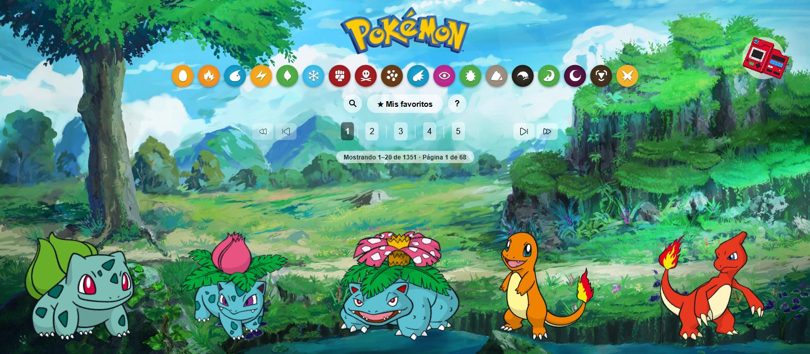

## Contenido

- [Funcionalidades](#funcionalidades)
- [Cambios respecto a v1.0.0](#cambios-respecto-a-v100)
- [Stack técnico](#stack-técnico)
- [Requisitos e instalación](#requisitos-e-instalación)
- [Scripts](#scripts)
- [Arquitectura](#arquitectura)
- [Datos y caché](#datos-y-caché)
- [Pruebas y Storybook](#pruebas-y-storybook)
- [Accesibilidad](#accesibilidad)
- [Limitaciones conocidas](#limitaciones-conocidas)
- [Licencia](#licencia)

## Funcionalidades

### Listado y paginación

El listado carga 20 Pokémon por página sobre un total de 1351 registros: 1025 especies y las formas alternativas (identificadores desde 10001). El paginador muestra cinco páginas visibles y saltos a la primera y última. Bajo él, un indicador informa el rango mostrado y la página actual ("Mostrando 1–20 de 1351 · Página 1 de 68").

Cada tarjeta se despliega al pasar el cursor y muestra número, experiencia base, tipos, peso y altura.

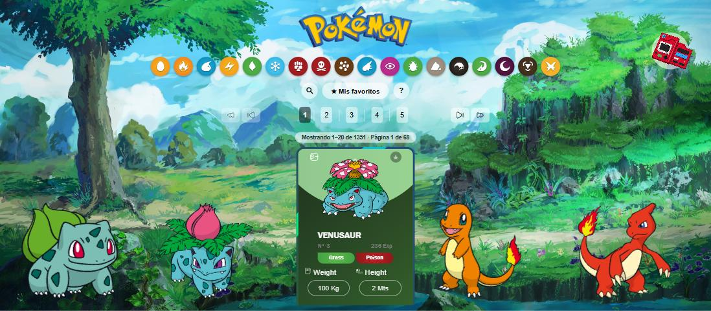

Al hacer clic, la tarjeta gira y muestra la matriz de tipos del Pokémon: los tipos contra los que recibe daño doble o cuádruple, los que lo resisten y los que no le afectan.

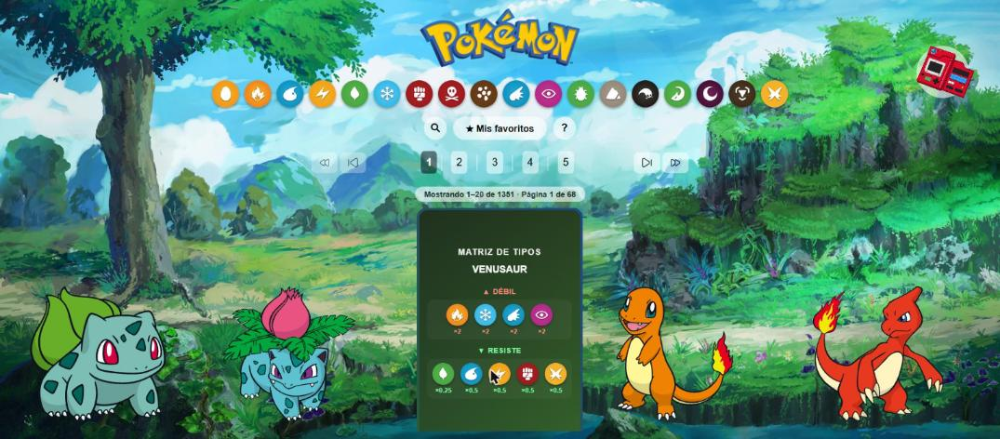

### Filtro por tipo

Los 18 tipos se pueden combinar. El filtro aplica lógica OR: una selección de Fuego y Volador lista los Pokémon que tienen al menos uno de los dos tipos. Los tipos no seleccionados se muestran en escala de grises, y el botón "Ver todos" limpia la selección. La paginación y el contador de resultados se recalculan sobre el conjunto filtrado.

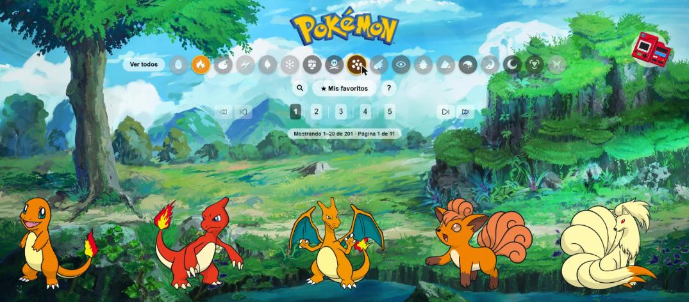

### Búsqueda por nombre o número

La lupa junto a "Mis favoritos" se expande en un campo de texto. Acepta el nombre (`pikachu`, `Mr Mime`) o el número de Pokédex (`25`, `#25`). El texto se normaliza antes de consultar: se eliminan mayúsculas, acentos y el prefijo `#`, y los espacios pasan a guiones.

- **Enter** ejecuta la búsqueda.
- **Esc**, vaciar el texto o cerrar la lupa devuelve el listado completo.
- Buscar reemplaza cualquier filtro por tipo o vista de favoritos activos.


Cuando la PokéAPI responde 404, la aplicación muestra una carta con una pokébola que, al pasar el cursor, indica "Pokémon no encontrado" y deja los datos en `???`. Los errores de red o del servidor se distinguen de esta ausencia y se informan como error.

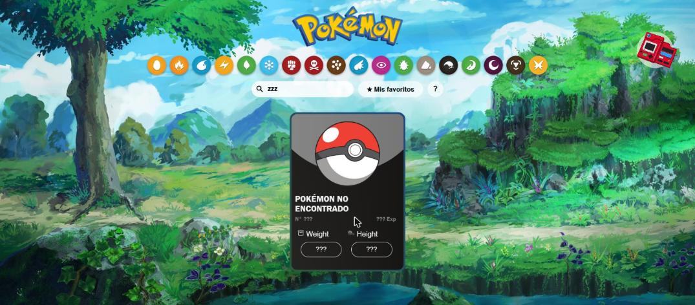

### Favoritos

La estrella de cada tarjeta marca un Pokémon como favorito. La selección se guarda en `localStorage` (clave `pokemon-wiki:favorites`) y "Mis favoritos" lista todos los marcados, sin importar la página en la que estén. Si no hay ninguno, se muestra un panel que explica cómo agregarlos.

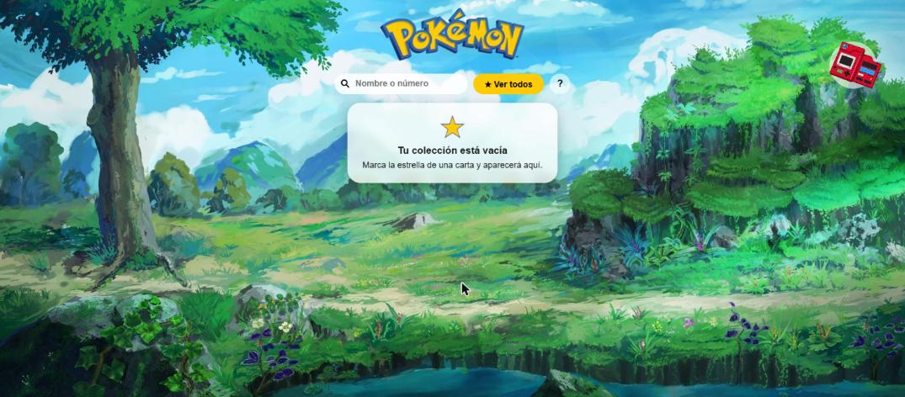

### Pokédex retro

El icono de Pokédex en la esquina superior derecha abre un dispositivo con dos mitades. También se abre con el botón de cualquier tarjeta, o soltando el icono sobre una tarjeta, y en ambos casos carga ese Pokémon.

- **Teclado numérico:** ingresa un número de hasta 7 dígitos. `GO` busca y `DEL` borra.
- **PREV / NEXT:** recorre los números en orden. Tras el 1025 salta a las formas alternativas (10001) y viceversa.
- **Cruz direccional:** izquierda y derecha cambian entre las cinco vistas de la pantalla; arriba y abajo desplazan el contenido.
- **Botón de encendido:** el dispositivo debe estar encendido para aceptar entradas.
- **Botón rojo bajo la pantalla:** reproduce el grito del Pokémon.

La pantalla tiene cinco vistas. La ilustración usa los sprites de las generaciones I y II. La descripción usa el texto de la especie en español y recurre al inglés si no existe traducción. Los movimientos listan los primeros 15 de la especie.

| Ilustración | Estadísticas |
| --- | --- |
| 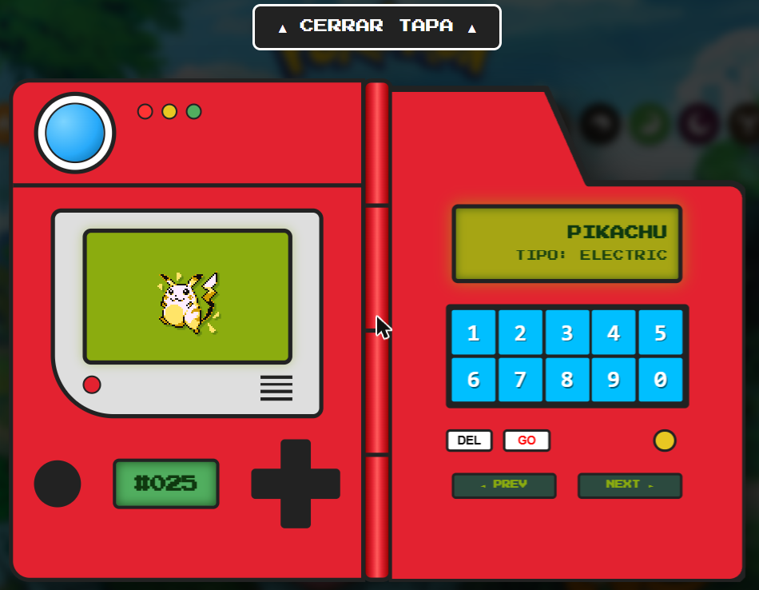 | 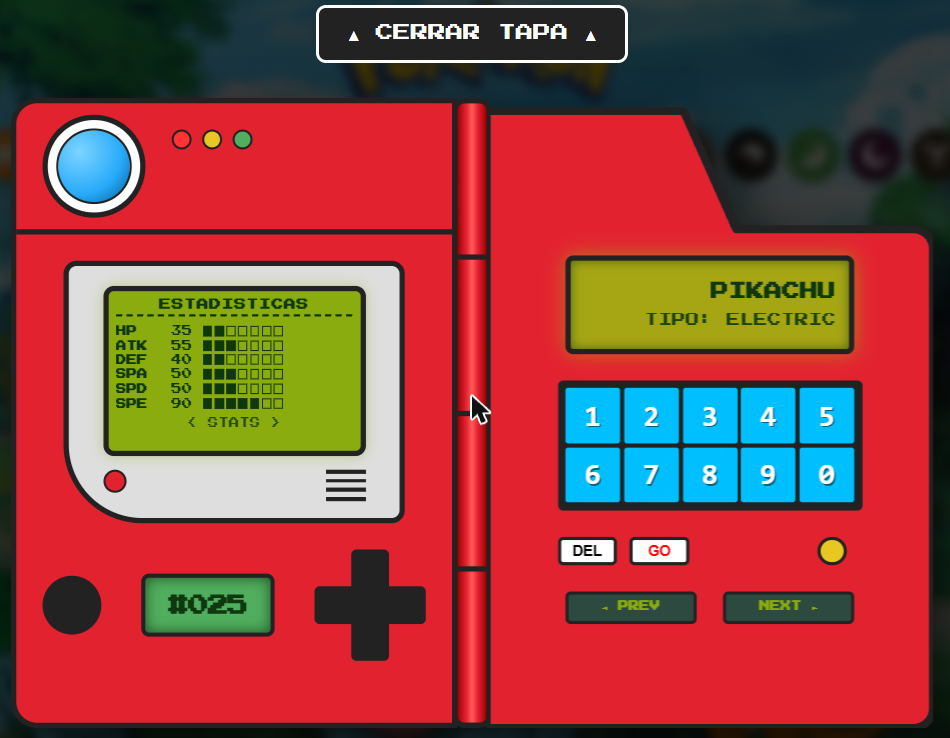 |
| **Movimientos** | **Descripción** |
| 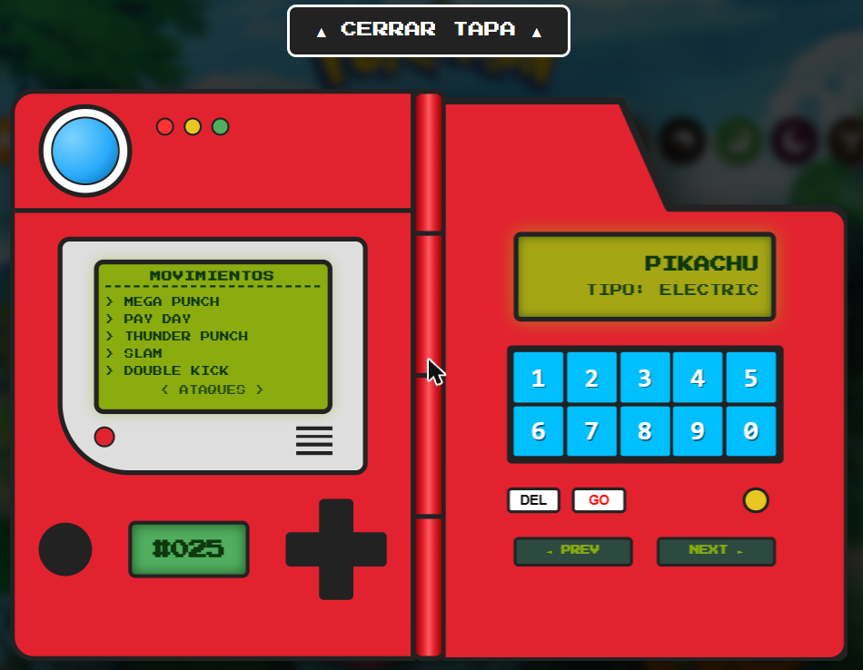 | 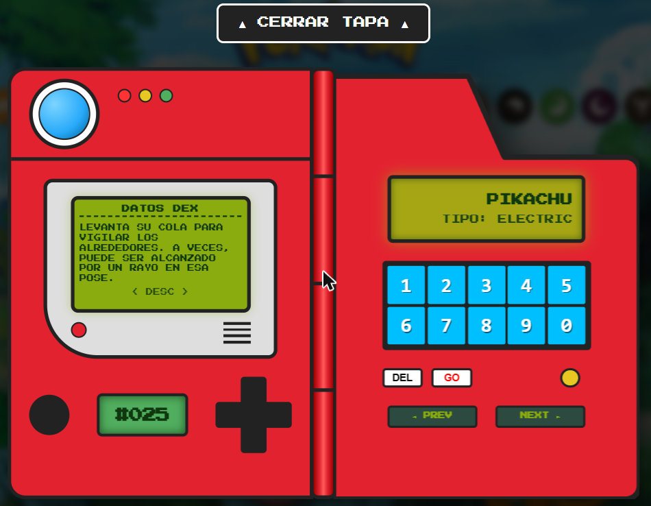 |

La vista de estadísticas muestra las seis estadísticas base (HP, ATK, DEF, SPA, SPD, SPE), cada una con una barra de siete bloques. La de evolución lista la línea evolutiva de la especie.

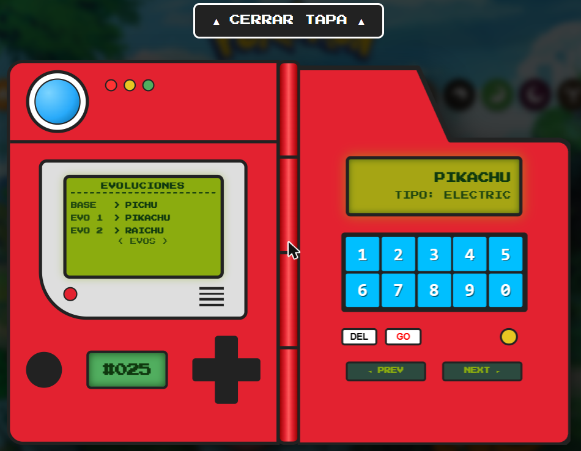

### Tutorial guiado

El botón `?` inicia un recorrido de 22 pasos, implementado con [Driver.js](https://driverjs.com), que cubre la Pokédex, el filtro, la búsqueda, los favoritos, la paginación y las tarjetas. Se carga bajo demanda con un `import()` dinámico, de modo que no forma parte del bundle inicial.

## Cambios respecto a v1.0.0

La versión 1.0.0 es la base heredada (Legacy). La 2.0.0 reemplaza el tooling, reorganiza el código y agrega la mayoría de las funcionalidades descritas arriba.

| Área | v1.0.0 (Legacy) | v2.0.0 |
| --- | --- | --- |
| Build y servidor de desarrollo | Rollup y `web-dev-server` (Open WC) | Vite 8 |
| Pruebas | `web-test-runner` | Vitest con cobertura |
| Documentación de componentes | No existía | Storybook 10, una story por componente |
| Estadísticas | Gráfico con Chart.js en la tarjeta | Seis estadísticas base en la Pokédex retro; Chart.js se eliminó |
| Resultados por página | 60 | 20, con caché de páginas |
| Filtros y búsqueda | No existían | Filtro por tipo (OR), búsqueda por nombre o número |
| Favoritos | No existían | Persistentes en `localStorage` |
| Pokédex retro | No existía | Dispositivo con teclado, cruz direccional y cinco vistas |
| Matriz de tipos | No existía | Cara posterior de la tarjeta |
| Tutorial | No existía | Recorrido guiado de 22 pasos |
| Estructura | Componentes agrupados por tipo (`API/`, `view/`) | Un directorio por componente y capa de datos de tres niveles |
| Dependencias | Vulnerabilidades sin resolver | Sin vulnerabilidades conocidas en la rama |

## Stack técnico

| Herramienta | Uso |
| --- | --- |
| [Lit 2](https://lit.dev) | Web Components |
| [Vite 8](https://vite.dev) | Servidor de desarrollo y build |
| [Vitest 5](https://vitest.dev) | Pruebas unitarias con cobertura |
| [Storybook 10](https://storybook.js.org) | Catálogo de componentes aislados |
| [Driver.js](https://driverjs.com) | Tutorial guiado |
| [Custom Elements Manifest Analyzer](https://custom-elements-manifest.open-wc.org) | Genera `custom-elements.json` con la API de cada componente |
| [PokéAPI](https://pokeapi.co) | Fuente de datos |

## Requisitos e instalación

- Node.js 22.12 o superior (requisito de Vitest 5; Vite 8 acepta también 20.19)
- npm

```bash
npm install
npm run dev
```

## Scripts

| Comando | Descripción |
| --- | --- |
| `npm run dev` | Servidor de desarrollo con recarga en caliente |
| `npm run build` | Build de producción en `dist/` y regeneración de `custom-elements.json` |
| `npm run preview` | Sirve el build de producción |
| `npm run test` | Ejecuta las pruebas una vez, con cobertura |
| `npm run test:watch` | Ejecuta las pruebas en modo watch |
| `npm run storybook` | Storybook en `localhost:6006` |
| `npm run storybook:build` | Build estático de Storybook en `storybook-static/` |
| `npm run analyze` | Regenera `custom-elements.json` |

## Arquitectura

```
src/
  main.js                       # punto de entrada
  app/
    pokemon-wiki/               # componente raíz: estado, orquestación, estilos
    app-tour/                   # tutorial guiado
  components/                   # un directorio por componente
    pokemon-card/               # tarjeta con cara frontal y matriz de tipos
    pokemon-list/               # cuadrícula de tarjetas
    pokemon-search/             # lupa expandible y normalización de la consulta
    pokemon-type-filter/        # selector de tipos
    pagination/                 # paginador, más pagination-button y pagination-numbers
    page-toolbar/               # búsqueda, favoritos y tutorial
    page-range-info/            # indicador de rango y página
    favorites-empty/            # estado vacío de favoritos
    pokedex-app/                # Pokédex retro, orquestador
    pokedex-*/                  # teclado, cruz direccional, sensor, pantalla y vistas
  services/
    api/                        # peticiones HTTP a la PokéAPI
    data-managers/              # transformación y caché
    favorites-store.js          # persistencia de favoritos
  storybook-helpers/            # datos compartidos por las stories
```

### Capa de datos

Tiene tres niveles y ningún componente llama a `fetch`:

1. `services/api` (`PokeApi`) realiza las peticiones y construye las URL. No transforma respuestas. Los errores HTTP incluyen la propiedad `status`, lo que permite distinguir un 404 de una falla de red.
2. `services/data-managers` (`PokemonDataManager`, `PokedexEntryDataManager`) convierte la respuesta cruda en el modelo que consume la interfaz y mantiene las cachés.
3. Los componentes reciben datos ya transformados.

### Convenciones de componentes

- Cada componente vive en su propio directorio junto con su story, sus pruebas y sus utilidades. Un helper que usa un solo componente se queda en su directorio.
- Los componentes que orquestan (`pokedex-app`, `pokemon-card`, `pagination`) componen piezas pequeñas y se comunican con eventos `composed` (`dpad-click`, `digit-click`, `favorites-toggle-click`, `search-submit`, entre otros).
- Los estilos se separan a un archivo `.styles.js` solo en los componentes muy extensos.
- La lógica pura (normalización de consultas, cálculo de rangos y páginas, efectividad de tipos) está en funciones sin DOM, que se prueban por separado.

## Datos y caché

La PokéAPI pide cachear las respuestas localmente. La aplicación mantiene en memoria dos cachés en `PokemonDataManager`: una por combinación de página y tamaño de página, y otra con la lista de nombres de cada combinación de tipos. El filtro por tipo obtiene la lista de nombres una vez y solicita el detalle únicamente de los Pokémon de la página visible.

Un token de petición compartido descarta las respuestas tardías: si el usuario cambia de página, de filtro o de búsqueda antes de que termine una carga anterior, el resultado obsoleto no reemplaza al vigente.

## Pruebas y Storybook

`npm run test` ejecuta las pruebas de la capa de datos (API y data managers), del paginador, del cálculo de rangos, de la normalización de búsqueda y de la voz de la Pokédex. Cubren los casos de error y de borde, como el 404 de una búsqueda o un fallo de red.

Todos los componentes tienen al menos una story con sus casos de uso. `npm run storybook` las sirve en `localhost:6006`.

## Accesibilidad

- Los controles icónicos tienen etiqueta accesible (`aria-label`); la lupa expone `aria-expanded` y el botón de favoritos `aria-pressed`.
- La búsqueda es operable solo con teclado: Enter confirma y Esc cierra.
- Los estados vacíos usan `role="status"`.
- Las animaciones respetan `prefers-reduced-motion`.

## Limitaciones conocidas

- La línea evolutiva de la Pokédex sigue solo la primera rama de cada cadena. En Pokémon con evoluciones ramificadas, como Eevee, se omiten las demás, y no se muestran las condiciones de evolución.
- Las cachés son solo en memoria y se pierden al recargar la página.
- Los 1351 registros incluyen formas alternativas al final de la lista, y la interfaz no las distingue de las especies.
- La búsqueda exige el nombre exacto o el número. No hay autocompletado.
- La narración por voz de la Pokédex está implementada (`pokedex-voice.js`) pero desactivada y sin exposición en la interfaz.

## Licencia

MIT, según el campo `license` de `package.json`.
